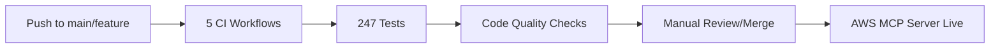

# Branch Strategy & CI/CD Pipeline

## 🌳 Current Git Branch Structure

```
main (production & development)
├── feature/new-shape-types (optional)
├── feature/ml-integration (optional)  
└── hotfix/critical-security-fix (when needed)
```

**Note**: Currently using single-branch workflow. No separate develop branch exists.

## 🚀 Deployment Flow

### 1. Current Development Workflow
```bash
# Create feature branch from main (optional)
git checkout main
git pull origin main
git checkout -b feature/your-feature  # Optional: can work directly on main

# Make changes and commit
git add .
git commit -m "feat: add new feature"

# Push to GitHub
git push origin feature/your-feature

# Create PR to main branch
# - All 5 GitHub Actions workflows run automatically
# - 247 tests execute across 6 modules
# - Web validation runs
# - Manual merge after review
```

### 2. Current Development Flow


### 3. Current Environment URLs

| Environment | URL | Type | Branch |
|------------|-----|------|---------|
| Local Web | http://localhost:8000 | Web Interface | any |
| Local API | http://localhost:8000/api | REST API | any |
| AWS MCP | https://s6ngc23inj.execute-api.us-east-1.amazonaws.com/prod/mcp | MCP Server | main |

## 🔧 Initial Setup

### 1. Create Branches
```bash
# If not already created
git checkout -b develop
git push -u origin develop

# Set branch protection rules on GitHub
# - Require PR reviews
# - Require status checks to pass
# - Dismiss stale reviews
# - Include administrators
```

### 2. AWS Setup

#### Frontend (S3 + CloudFront)
```bash
# Development
aws s3 mb s3://geometry-engine-frontend-dev
aws cloudfront create-distribution --distribution-config file://cloudfront-dev.json

# Production  
aws s3 mb s3://geometry-engine-frontend-prod
aws cloudfront create-distribution --distribution-config file://cloudfront-prod.json
```

#### Backend Option A: Lambda
```bash
# Development
aws lambda create-function \
  --function-name geometry-engine-api-dev \
  --runtime python3.11 \
  --role arn:aws:iam::ACCOUNT:role/lambda-execution-role \
  --handler web_api.handler

# Production
aws lambda create-function \
  --function-name geometry-engine-api-prod \
  --runtime python3.11 \
  --role arn:aws:iam::ACCOUNT:role/lambda-execution-role \
  --handler web_api.handler
```

#### Backend Option B: ECS
```bash
# Create ECR repository
aws ecr create-repository --repository-name geometry-engine-api

# Create ECS clusters
aws ecs create-cluster --cluster-name geometry-engine-dev
aws ecs create-cluster --cluster-name geometry-engine-prod
```

### 3. GitHub Secrets

Add these secrets to your GitHub repository:

#### Development Secrets
- `AWS_ACCESS_KEY_ID` - AWS credentials for dev
- `AWS_SECRET_ACCESS_KEY` - AWS secret for dev
- `CLOUDFRONT_DISTRIBUTION_ID_DEV` - CloudFront ID for dev
- `ECR_REGISTRY` - ECR registry URL

#### Production Secrets (use environment)
- `AWS_ACCESS_KEY_ID_PROD` - AWS credentials for prod
- `AWS_SECRET_ACCESS_KEY_PROD` - AWS secret for prod
- `CLOUDFRONT_DISTRIBUTION_ID_PROD` - CloudFront ID for prod

### 4. GitHub Variables

Set repository variables:
- `BACKEND_TYPE` - Either "lambda" or "ecs"

## 📋 Deployment Checklist

### Before First Deployment
- [ ] Create develop branch
- [ ] Set up branch protection rules
- [ ] Create AWS S3 buckets
- [ ] Create CloudFront distributions
- [ ] Create Lambda functions or ECS clusters
- [ ] Add all GitHub secrets
- [ ] Configure Route 53 domains

### For Each Feature
- [ ] Create feature branch from develop
- [ ] Make changes and test locally
- [ ] Push and create PR to develop
- [ ] Wait for CI/CD checks
- [ ] Merge to develop (auto-deploys)
- [ ] Test in dev environment
- [ ] Approve auto-created PR to main
- [ ] Monitor production deployment

## 🚨 Emergency Procedures

### Hotfix to Production
```bash
# Create hotfix from main
git checkout main
git checkout -b hotfix/critical-fix

# Make fix and push
git push origin hotfix/critical-fix

# Create PR directly to main
# After merge, cherry-pick to develop
git checkout develop
git cherry-pick <commit-hash>
git push origin develop
```

### Rollback Production
```bash
# Frontend: Invalidate CloudFront and restore previous S3 version
aws s3 sync s3://geometry-engine-frontend-prod-backup s3://geometry-engine-frontend-prod
aws cloudfront create-invalidation --distribution-id $DIST_ID --paths "/*"

# Backend Lambda: Use alias to point to previous version
aws lambda update-alias --function-name geometry-engine-api-prod \
  --name LIVE --function-version $PREVIOUS_VERSION

# Backend ECS: Update service with previous task definition
aws ecs update-service --cluster geometry-engine-prod \
  --service geometry-engine-api-prod \
  --task-definition geometry-engine-api-prod:$PREVIOUS_REVISION
```

## 🔄 Workflow Files

1. **`.github/workflows/ci.yml`** - Main test suite
2. **`.github/workflows/web-validate.yml`** - Web standards validation
3. **`.github/workflows/deploy-development.yml`** - Deploy to dev environment
4. **`.github/workflows/deploy-production.yml`** - Deploy to production

## 🎯 Best Practices

1. **Never push directly to main** - Always use PRs
2. **Test in development first** - Let changes soak in dev
3. **Use semantic commits** - feat:, fix:, docs:, etc.
4. **Tag releases** - Automatic tagging on production deploy
5. **Monitor after deploy** - Check health endpoints and metrics

## 📊 Monitoring

### Health Checks
- Dev Frontend: https://dev.geometry-engine-api.com
- Dev API: https://api-dev.geometry-engine-api.com/api/health
- Prod Frontend: https://geometry-engine-api.com  
- Prod API: https://api.geometry-engine-api.com/api/health

### CloudWatch Dashboards
- Lambda metrics: Invocations, errors, duration
- ECS metrics: CPU, memory, task count
- CloudFront metrics: Requests, bandwidth, cache hit rate
- API Gateway metrics: 4XX/5XX errors, latency

---

This setup provides a robust CI/CD pipeline with automatic deployment to development and controlled deployment to production!